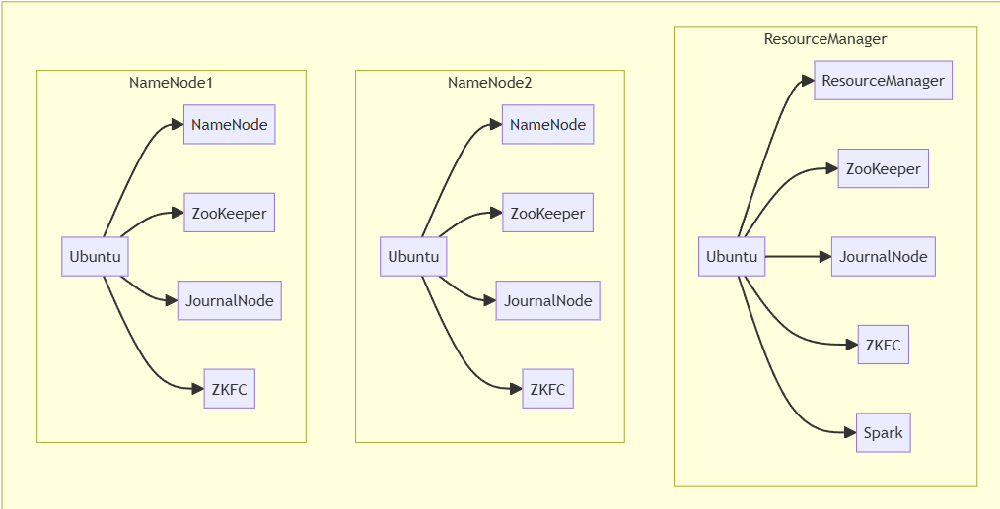
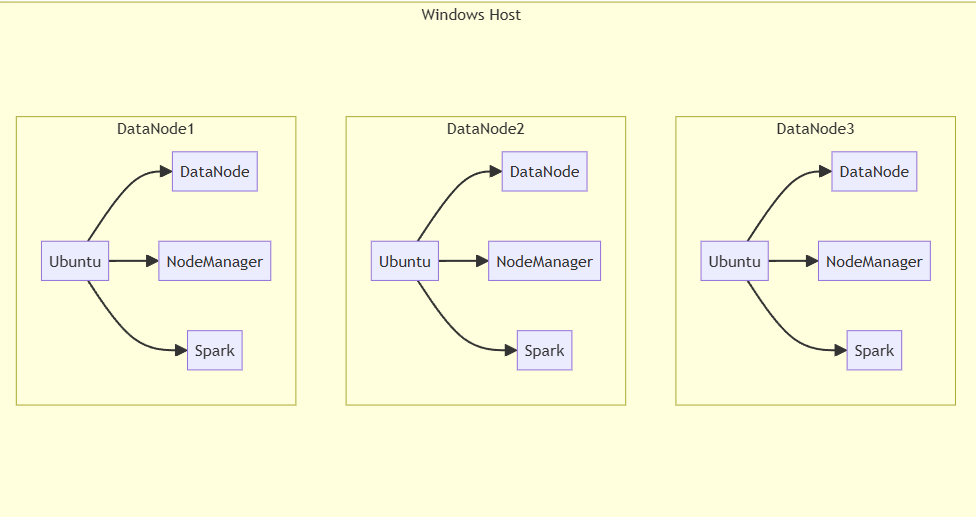
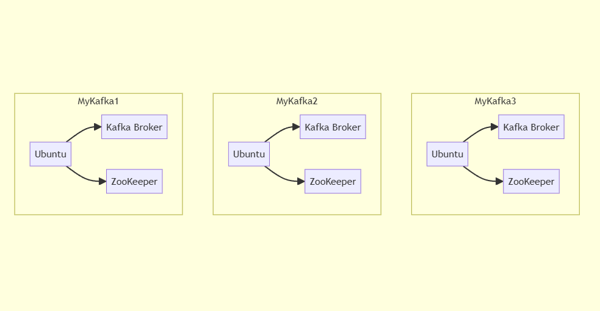

# 프로젝트 정보
**base-distributed-etl**
## 개요

윈도우 로컬 호스트에 도커화된 하둡, 스파크, 카프카로 이루어진 완전 분산 데이터 ETL 시스템을 구축해보자.

## 프로젝트 목적, 의의

1. 빅데이터에 필요한 데이터 레이크, 데이터 마켓 구성
2. 아직 숙달되지 못한 기술들의 숙달
    - 카프카 클러스터 브로커
    - 스파크 분산데이터 처리
    - 하둡, 스파크, 카프카로 연결되는 데이터 ETL
3. 개인 환경에서 분산 애플리케이션 구성, 학습 및 디버깅용 서버로도 사용가능

## 기능

### 서버 구성

- 윈도우 호스트의 도커 클러스터
    - 도커파일로 이미지 생성, 도커 컴포즈로 클러스터 구성
    - 포트 포워딩으로 로컬호스트에서 웹 UI 모니터링 (일부 기능 제한됨)
- 우분투 리눅스 사용
    - sh 파일 작성하여 설치와 서버 시작 구성
    - ssh을 이용한 컨테이너 관리
- 고강용성 하둡 클러스터 운영
    - 네임노드1-2, 데이터노드1-3, 리소스매니저 노드로 이루어진 하둡 클러스터
    - 저널노드, 주키퍼, ZKFC를 이용한 네임노드 고가용성
    - 도커 볼륨으로 클러스터 재시작, 데이터 저장 및 로그 저장
- 스파크 클러스터 운영
    - YARN을 이용한 스파크 클러스터 (리소스매니저와 데이터노드의 메모리 사용)
- 카프카 클러스터 운영
    - 카프카노드 3개로 카프카 앙상블(클러스터) 운영

### 구현

- 하둡 API
    - 도커 컨테이너의 데이터 hdfs에 저장
- 스파크 API
    - hdfs에 저장된 데이터 DF으로 읽기
    - DF을 Hdfs에 저장 (디렉터리 형식) 및 읽기
    - DF을 전처리
        - 결측치 제거
        - 새로운 열 생성
        - 필요한 열만 골라 새 데이터프레임으로 반환
    - DF을 카프카 서버로 전송
- 문서작성
    - 깃허브, 벨로그, 노션글로  환경설정, 구현 내용 정리와 분석


## 구조

해당 프로젝트는 윈도우 호스트에서 9개의  도커 노드로 구성됩니다.






네임노드1, 네임노드2

- 우분투
- 네임노드, 주키퍼, 저널노드, ZKFC

리소스매니저

- 우분투
- 리소스매니저, 주키퍼, 저널노드, ZKFC
- 스파크

데이터노드1, 데이터노드2, 데이터노드3

- 우분투
- 데이터노드,노드매니저
- 스파크

마이카프카1, 마이카프카2, 마이카프카3

- 우분투
- 카프카 브로커, 주키퍼

# 사용법

## 깃허브

https://github.com/gnswp21/base-distributed-etl

### 설치

1. git clone https://github.com/gnswp21/base_distributed_etl.git
2. jdk-11.0.10_linux-x64_bin.deb 다운, conf/java 디렉터리에 저장

### 도커 이미지, 컨테이너 생성

1. 이미지 빌드
    1.   `.\start-build.cmd`
2. 도커 컴포즈
    1. `docker compose up -d`

### 하둡, 카프카 클러스터 실행

1. 하둡 클러스터 실행
    1. `docker exec -it namenode1 bash`
    2. 클러스터 첫 실행인지 재실행인지에 따라
        1. `sh cluster-init.sh`
        2. `sh cluster-restart.sh`
2. 카프카 브로커 실행
    1. `docker exec -it mykafka1 bash`
    2. `sh kafka-init.sh`

### 데이터 ETL

1. 하둡에 데이터 저장
    1. `docker exec -it namenode1 bash`
    2. /root 디렉토리에서 다음 코드 실행

    ```bash
    hadoop jar apps/base-distributed-etl-1.0-SNAPSHOT.jar
    ```

2. 스파크로 데이터 전처리 후 카프카에 전송
    1. `docker exec -it resourcemanager bash`
    2. /root/spark 디렉터리에서 다음 코드 실행

    ```bash
    spark-submit \
      --class com.example.load.SparkTester \
      --master yarn \
      --deploy-mode client \
      --conf spark.driver.host=resourcemanager \
      --packages org.apache.spark:spark-sql-kafka-0-10_2.13:3.4.3 \
    apps/base-distributed-etl-1.0-SNAPSHOT.jar
    ```


### 추가
더 자세한 설명은 다음 글에서 확인할 수 있습니다.
1. 노션(가독성) : https://www.notion.so/brioblog/ETL-base-distributed-etl-e39b5254d51c42188aaee16bb294f3d6#90d94c745ab04dbd978172365fa14bee
2. 벨로그(빠른로딩)(미구현)
